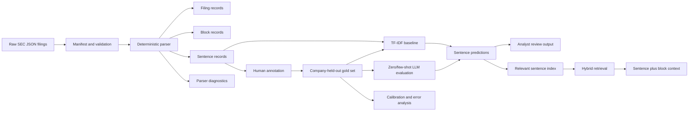
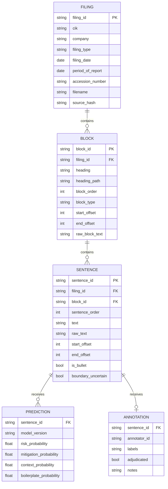
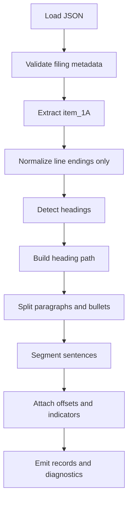
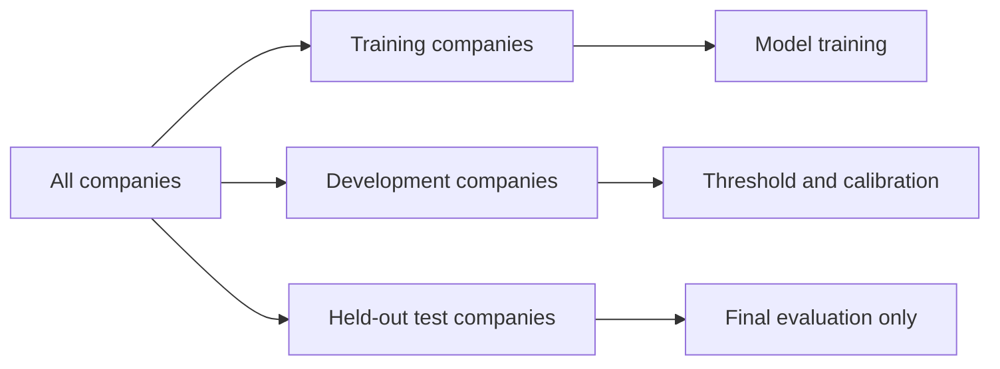
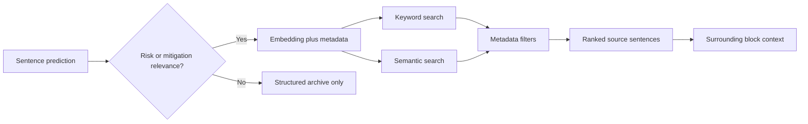

# RiskLens Overview

## Purpose

RiskLens helps financial analysts review SEC Form 10-K Item 1A risk disclosures more efficiently.

The system identifies sentence-level evidence for:

- `RISK_STATEMENT` — adverse events, exposures, uncertainties, vulnerabilities, or consequences;
- `MITIGATION` — controls, policies, safeguards, hedges, recovery mechanisms, or risk-reducing actions;
- `SUPPORTED_CONTEXT` — factual or explanatory information needed to understand a risk or mitigation;
- `BOILERPLATE` — generic or repetitive disclosure with limited company-specific value.

Labels are independent. A sentence can receive more than one label. The first analyst-facing output is sentence evidence with its filing, block heading, probabilities, and surrounding context.

## Current baseline

The repository currently contains:

- raw extracted Item 1A JSON filings under `data/extracted_filings/10-K/`;
- a derived `data/raw/sec_10k.csv` containing filing metadata and full `item_1A` text;
- scripts for downloading company CIKs and creating the CSV dataset;
- basic dataset-loading and logging utilities;
- no parser, annotation set, classifier, or retrieval layer yet.

The raw JSON is the immutable source of truth. CSV is a convenience export; normalized filing, block, and sentence data should become the modeling boundary.

## System view

## Structured records

### Filing records

Include filing ID, CIK, company, filing type, filing date, reporting period, SIC where available, accession/file identifiers, source URLs, source hash, extraction version, and processing timestamp.

### Block records

Include block ID, filing ID, block order, heading, heading path, block type, raw text, and source offsets. Block types may include heading, paragraph, bullet group, and list item.

### Sentence records

Include sentence ID, filing ID, block ID, sentence order, original and normalized text, source offsets, bullet/list indicators, normalization status, and boundary uncertainty.

Offsets use half-open intervals: `[start, end)`, measured against the original `item_1A` string. The original substring must always be recoverable from the stored offsets.

## Stable identity rules

| Record | Recommended identity |
|---|---|
| Filing | Hash of canonical CIK, accession number, filing type, and reporting period |
| Block | Hash of filing ID, raw start offset, raw end offset, and block type |
| Sentence | Hash of block ID, raw start offset, raw end offset, and sentence order |

The dataset manifest must record source file hashes, parser version, normalization version, creation time, and record counts. Parser changes must be versioned rather than silently replacing earlier derived data.

## Parsing pipeline

The parser must preserve raw text and only apply controlled normalization to modeling text. It must protect SEC abbreviations, decimal values, percentages, citations, parenthetical material, company names, bullet markers, and numbered lists. Uncertain boundaries should be retained with a diagnostic instead of discarded.

Validation should detect duplicate filing IDs, missing metadata, empty Item 1A text, inconsistent URLs, invalid offsets, unrecoverable sentence text, missing references, duplicate sentence IDs, and unexpected labels.

## Annotation and evaluation

Create the 500-sentence human gold set before generating LLM labels. Include companies, industries, heading paths, bullets, short and long sentences, likely boilerplate, mixed-label examples, and ambiguous cases.

Use company-held-out splits:

With the initial 14-company corpus, an approximate 8/3/3 company allocation is reasonable if it preserves industry diversity. The exact split must be recorded and never changed during model comparison.

Required metrics include per-label precision, recall, F1, PR-AUC, calibration, exact multi-label match, label co-occurrence, high-confidence precision, useful-findings coverage by block, boilerplate burden, and source-traceability success.

An internal `NONE_OTHER` state may be used so that every sentence is not forced into an analyst-facing label.

## Modeling sequence

1. Build a TF-IDF one-vs-rest logistic regression baseline. Compare a linear SVM if useful, but retain logistic regression as the probability/ranking baseline.
2. Evaluate zero-shot and few-shot LLM classification on the same gold data and splits.
3. Store model name/version, prompt version, raw response, parsed labels, probabilities, timestamp, and validation status.
4. Use synthetic LLM labels only after human auditing and only with explicit synthetic-data metadata.
5. Store all probabilities. Apply high-confidence thresholds at presentation time, not during classification.

## Retrieval direction

Index risk- and mitigation-relevant sentences only after classification quality is acceptable. Retain sentence text, raw text, company, CIK, period, heading path, IDs, label probabilities, model version, and source offsets with every vector.

Start with simple local or tabular search while the data contract is evolving. Add Qdrant only when embedding choice, metadata filters, re-indexing behavior, and analyst query patterns are stable. Retrieval should combine semantic similarity, keyword matches, metadata filters, confidence, and duplicate reduction. Results must show source evidence rather than only generated summaries.

## Design tradeoffs

| Decision | Benefit | Cost |
|---|---|---|
| Sentence-first modeling | Precise evidence and annotation | Some meaning depends on nearby sentences |
| Multi-label output | Represents risk/mitigation overlap | More annotation and calibration work |
| Raw offsets and stable IDs | Strong auditability | Parser changes require versioning |
| Company-held-out evaluation | More realistic generalization | Fewer independent examples |
| TF-IDF baseline | Transparent and inexpensive | Limited semantic understanding |
| Qdrant later | Avoids premature infrastructure | Search arrives later |

The core principle is: **sentences are the modeling and retrieval unit; blocks and filings provide context and auditability.**
